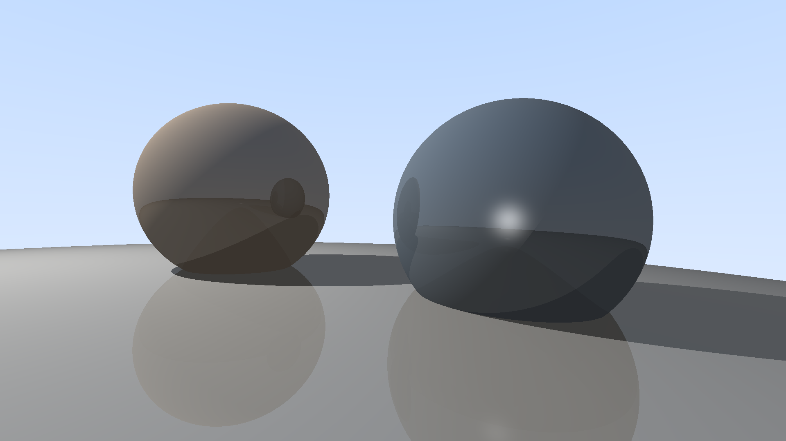

# RTX. It's ON!!!

  

这个原本是我给成信大计算机学院《计算机图形学A》课程设计的实验，这里也放在这里供大家参考学习。某些库看上去设计得有点💩，之后会迭代。

光线追踪实验室（Ray Tracing Lab）`v0.0.1`

假定你有面向对象编程（C++）以及计算机图形学的基础，你需要里实现一些基础数学库，它们包括：
1. 数学库（包含三维向量的基本运算）
2. 颜色
3. 光线
4. 球体
5. 光源

你需要在这些类的基础上实现一个光线追踪算法，并自行搭建场景（硬编码），渲染出包含球体和光源的场景。
